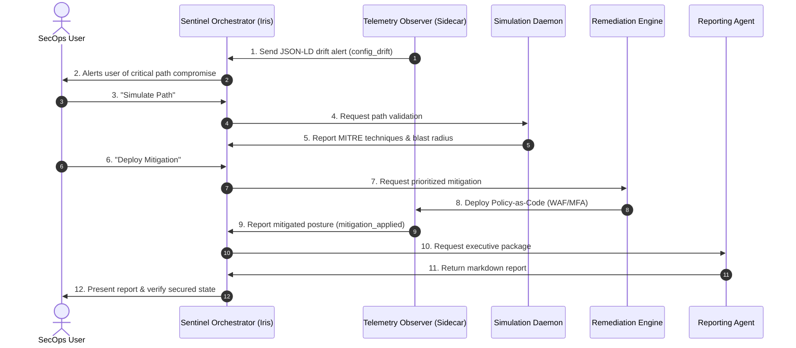
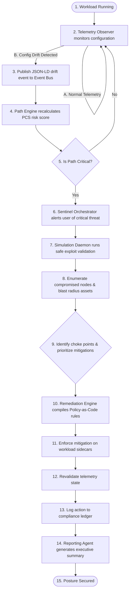

# Agentic Architecture & Workflows: Project "Sentinel"

This document outlines the active AI agents and daemon systems in the Project Sentinel architecture, explaining why this implementation enhances the attack path user experience, detailing the three implemented use cases (with their direct impacts and UX enhancements), and presenting visual workflows.

---

## 1. Registry of Active Agents

Project Sentinel utilizes a swarm of specialized agentic services to monitor, validate, and secure the cloud environment:

| Agent Name | Operational Scope | Trigger | Output |
| :--- | :--- | :--- | :--- |
| **Sentinel Orchestrator** (Agent Iris) | Central chatbot and user interface; coordinates scans and security recommendations. | User request | Scans, path selections, user interactions |
| **Telemetry Observer** (Sidecar Observer) | Local sidecars in workloads (`dev`, `ai`, `vpn`). Monitors processes and configurations. | Configuration drift or system events | JSON-LD schema drift alerts |
| **Simulation Daemon** | Safely maps exploit propagation paths and lists blast radius assets. | Orchestrator trigger | MITRE exploit validations & Blast radius logs |
| **Remediation Engine** | Calculates remediation priorities (choke points) and compiles policy assets. | Critical path alerts | Policy-as-Code rules, GitHub PRs |
| **Reporting / Analytics Agent** | Generates compliant executive summaries and parses predictive "what-if" models. | Mitigation completions | Markdown reports, compliance updates |

---

## 2. Why the Agentic Implementation Enhances User Experience

Transitioning from a traditional, static vulnerability dashboard to Project Sentinel's real-time agentic loop delivers four core user experience improvements:

1. **Elimination of "Scan Latency"**: 
   - *Legacy UX*: Users manually run scans or inspect week-old tables.
   - *Sentinel UX*: Kubernetes sidecars push events continuously. If a drift occurs, the Path Engine updates the risk metrics and pushes alerts in **<1 second** via Server-Sent Events (SSE).
2. **Contextual Risk Over CVSS Noise**:
   - *Legacy UX*: Engineers receive long tables of CVE numbers and waste hours searching for context.
   - *Sentinel UX*: The Simulation Daemon maps exactly where vulnerabilities sit on connected attack paths, showing whether they can reach crown-jewel databases.
3. **Frictionless Handoffs (Policy-as-Code)**:
   - *Legacy UX*: SecOps files manual JIRA tickets, causing delays and security friction.
   - *Sentinel UX*: The Remediation Engine auto-compiles rules (AWS WAF, Istio filters) and sends Pull Requests directly to developer repos.
4. **Time-Series Audit Replays**:
   - *Legacy UX*: Compliance audits rely on point-in-time screenshots.
   - *Sentinel UX*: A time-series ledger database stores all events, allowing auditors to pause stream feeds and scrub threat history timelines to verify posture compliance.

---

## 3. Implemented Use Cases & Attack Path Impact

The platform features three interactive use cases accessible via Agent Iris. Each use case directly alters the graph states and demonstrates a specific UX capability:

### Case 1: Workload Configuration Drift Detection
* **Scenario**: A developer opens an unauthorized ingress port on the Dev VM, exposing a Shadow API.
* **Impact on the Attack Path**: 
  - Activates a new entry node (`A` - Discovery Asset) and triggers the connection to `B` (Shadow API), establishing a complete traversal route to `G` (AD Core). It raises the environment Path Criticality Score (PCS) from 0 to 9.2.
* **Presented UX Enhancement**: 
  - Rather than reporting a simple isolated "open port" in a long spreadsheet, Sentinel maps the drift to the *entire target path*, showing the user exactly how the drift connects an attacker to the AD Core.

### Case 2: AI Posture & Supply Chain Validation
* **Scenario**: An external prompt injection vulnerability is simulated against an Internet-Exposed Auto-Billing AI Agent.
* **Impact on the Attack Path**:
  - Bridges a remote user host node (`W1`) through the AI Agent runtime (`W2`) directly to the crown-jewel Customer Root Database (`W3`), activating a prompt injection path that threatens sensitive data.
* **Presented UX Enhancement**:
  - Treats prompt injection vulnerabilities as first-class, dynamic path traversals rather than text-only issues. It allows the security operator to immediately visualize AI supply chain risk and approve an egress filter policy to neutralize it.

### Case 3: Prioritized Mitigation & Auditing
* **Scenario**: Multiple vulnerabilities compete on different workloads (VPN gateway vs Shadow API).
* **Impact on the Attack Path**:
  - Resolves competing paths by identifying which chokepoint (Node `B` or Node `F`) severs the most routes and drops the overall environment PCS score.
* **Presented UX Enhancement**:
  - Renders remediation trade-off metrics (paths closed, risk reduction delta, deployment time, and downtime). This replaces CVSS prioritization with a direct, business-impact mitigation priority checklist.

---

## 4. Visual Representation: Agent Interaction Model

The diagram below details how the agents communicate dynamically across the central event-bus to validate and secure a path:

---

## 5. End-to-End Agentic Workflow

The flowchart below demonstrates the decision-making logic and feedback loop of the Sentinel agent swarm:

