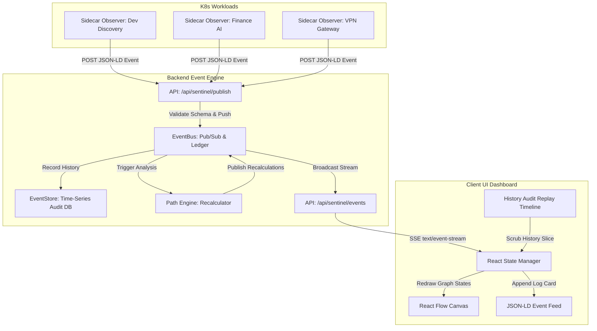

# Architecture & Design: Project "Sentinel"

This document details the event-driven architecture, JSON-LD schema definitions, and streaming protocols underlying Project Sentinel.

---

## System Architecture



---

## 1. Standardized JSON-LD Event Schema

All sidecars publish findings using the following schema payload contract:

```json
{
  "header": {
    "event_id": "uuid",
    "timestamp": "ISO8601",
    "agent_id": "string",
    "event_type": "string"
  },
  "context": {
    "resource_id": "string",
    "environment": "string"
  },
  "payload": {
    "category": "string",
    "finding": "string",
    "severity": "string",
    "evidence": {
      "port": 8080,
      "protocol": "TCP",
      "binaryPath": "string"
    }
  },
  "path_metadata": {
    "is_critical_path": true,
    "exploitability_score": 9.6
  }
}
```

### Event Type Definitions
- `agent_registration`: Sidecar starts up and registers telemetry capabilities.
- `config_drift`: Observes file, container mount, network interface, or cluster policy modifications.
- `simulation_injected`: Controlled security assessment triggered by researchers to test path resilience.
- `vulnerability_discovery`: Sidecar container image or dependency scans yield active vulnerability targets.
- `mitigation_applied`: Policy-as-Code applied (WAF, NetworkPolicy, MFA) that severs access vectors.

---

## 2. Server-Sent Events (SSE) Stream

We implement Server-Sent Events (`text/event-stream`) to synchronize the browser interface with backend telemetry changes. 
- **Endpoint**: `/api/sentinel/events`
- **Behavior**:
  - Upon connection, the stream queries the time-series history log (`EventStore.getHistory()`) and enqueues all existing records in chronological order to initialize the client's state.
  - The client is registered as a listener to the global `EventBus` singleton.
  - As new events are published, they are stringified and enqueued through a native `ReadableStream` pipeline to all open browser threads in `<1 second`.

---

## 3. Real-Time Graph Calculations

Rather than maintaining a separate graph database, the UI constructs its visual representation by parsing the event ledger chronologically:
1. The canvas is initialized with the standard workload nodes and edges in a `normal` state.
2. The UI scans events up to the selected replay slice index:
   - When a `config_drift` or `vulnerability_discovery` event is parsed, it marks the corresponding nodes as `compromised` and highlights the connecting edges with animated traversal dash-arrays.
   - When a `mitigation_applied` event is parsed, it marks the target workload node as `secured` and removes the animated dash-array from the blocked network path.
3. This guarantees that **vulnerability discovery** and **graph status recalculation** are fully synchronized and driven entirely by the backend-emitted event stream.
