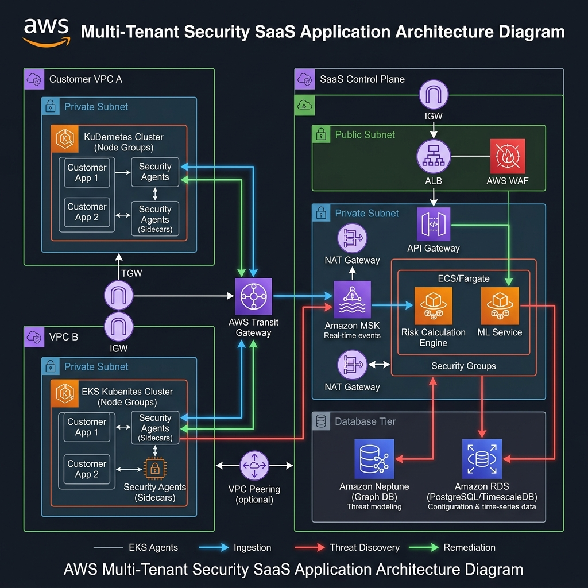
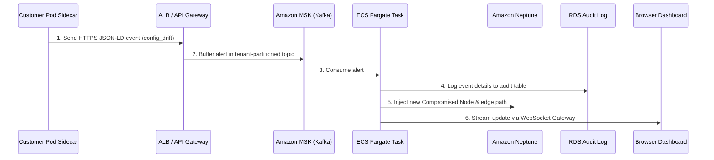

# AWS Architecture & Network Guide: attack-path-agent

This guide describes the enterprise-grade AWS cloud architecture, network topology, and security overlays designed to host the **attack-path-agent** platform at scale across multiple tenant environments.

---

## 1. Cloud Architecture Blueprint

The diagram below details the structural layout of the SaaS platform across both Customer Accounts and the SaaS Control Plane, showing edge boundaries, secure routing paths, and database segregation:

---

## 2. Deep Dive: AWS Constructs

The architecture leverages managed, resilient cloud constructs to segregate processing loads and secure data boundaries:

### A. Customer-Side VPC
- **Amazon EKS Cluster**: Runs the customer's production workloads.
- **Sidecar Observers**: Run as daemonsets or pod-level sidecars within EKS. They observe local pod processes, file changes, and exposed ports, sending telemetry out via `HTTPS`.
- **Kubernetes Operator**: A dedicated pull-based controller running in the EKS administrative namespace, polling the SaaS control plane for posture correction actions.

### B. Ingress & Edge Protection
- **AWS Route 53**: Directs customer telemetry and browser traffic to the nearest geographic load balancing endpoint.
- **AWS WAF (Web Application Firewall)**: Mitigates DDoS attacks, SQL injections, and scans, wrapping the API Gateway.
- **AWS ALB (Application Load Balancer)**: Terminates client TLS connections. It validates tenant access tokens and routes telemetry events to the streaming queue.

### C. Streaming & Event Buffer
- **Amazon MSK (Managed Streaming for Kafka)**: Buffers incoming telemetry streams in a highly available, multi-AZ messaging queue. This prevents high-volume event bursts (e.g., during sudden vulnerability scans) from overwhelming database workers.

### D. Computations & Graph Databases
- **AWS ECS on Fargate**: Hosts serverless, autoscaling ingestion workers that consume events from Kafka, validate their JSON-LD schemas, and update database stores.
- **Amazon Neptune (Graph DB)**: Stores the real-time node connections (Workloads, VPNs, Databases) for each tenant. Handles fast path calculations (Dijkstra/shortest-path traversal) dynamically.
- **Amazon RDS (PostgreSQL with TimescaleDB)**: Stores the long-term, indexed compliance audit ledger.

---

## 3. Network Topology & Security Overlay

### VPC & Subnet Layout
The control plane is segregated into three distinct subnet tiers across multiple Availability Zones:
1. **Public Subnet (DMZ)**:
   - Contains NAT Gateways and ALB interfaces.
   - External incoming requests from EKS clusters or dashboards hit this tier.
2. **Private Application Subnet**:
   - Hosts Amazon MSK brokers and ECS Fargate compute tasks.
   - Has no direct path to the internet. Traffic to the internet must route through NAT Gateways in the Public Subnet.
3. **Isolated Database Subnet**:
   - Hosts Amazon Neptune graph clusters and RDS databases.
   - Completely blocked from external ingress/egress. Inbound traffic is only allowed from the Private Application Subnet on specific ports (e.g., Neptune `8182` and PostgreSQL `5432`).

### Traffic Encryption & Identity
- **Mutual TLS (mTLS)**: Sidecars authenticate to the API Gateway using client certificates. The API Gateway extracts the client certificate CN (Common Name), which maps directly to the customer's `tenant_id`.
- **AWS KMS (Key Management Service)**: Telemetry logs in RDS and Neptune graphs are encrypted at rest using tenant-specific KMS customer-managed keys (CMKs).

---

## 4. End-to-End Use Case Workflows

### Workflow 1: Configuration Drift Ingestion & Recalculation

### Workflow 2: Zero-Trust Push-Remediation Flow
1. **Prioritization**: When the ECS Worker recalculates the graph paths in Neptune, it identifies a high-criticality choke point.
2. **Dashboard Notification**: The dashboard updates, showing the recommended WAF or Kubernetes network rule.
3. **Mitigation Queue**: The security admin clicks "Apply Policy". The backend writes a signed policy manifest to the Tenant's **AWS SQS (Simple Queue Service)** remediation queue.
4. **Local Apply**: The pull-based Kubernetes Operator inside the customer's EKS cluster pulls the message from SQS, verifies the cryptographic signature using a local public key, and applies the policy directly to the EKS cluster.
5. **Revalidation**: The sidecar registers the new state, sends a `mitigation_applied` event back, and the graph turns green.
